# X402 Solana Pay Protocol Diagram

```mermaid
sequenceDiagram
    autonumber
    participant Client
    participant ResourceServer as Resource Server
    participant Facilitator
    participant Blockchain as Solana Blockchain

    %% Step 1: Initial Request
    Client ->> ResourceServer: GET /resource
    ResourceServer -->> Client: 402 Payment Required + JSON {paymentRequirements}

    %% Step 2: Payment Payload Construction
    Note left of Client: Select payment method&#x3C;br/>Create payment payload (X-PAYMENT header)

    %% Step 3: Send Payment Payload
    Client ->> ResourceServer: GET /resource + X-PAYMENT header (base64 encoded payload)

    %% Step 4: Verify Payment
    ResourceServer ->> Facilitator: POST /verify {x402Version, paymentHeader, paymentRequirements}
    Facilitator -->> ResourceServer: Verification response {isValid: true/false, invalidReason}

    %% Step 5: Conditional Resource Fulfillment
    alt Payment Valid
        ResourceServer ->> ResourceServer: Fulfill resource request (internal work)
        
        %% Step 6: Settle Payment on Blockchain
        ResourceServer ->> Facilitator: POST /settle {x402Version, paymentHeader, paymentRequirements}
        Facilitator ->> Blockchain: Submit transaction (e.g., USDC transfer via Helio/Solana Pay)
        Blockchain -->> Facilitator: Transaction confirmed (txHash, confirmed status)
        Facilitator -->> ResourceServer: Payment Execution Response {success:true, txHash}
        
        %% Step 7: Return Successful Resource Response
        ResourceServer -->> Client: 200 OK + Resource data + X-PAYMENT-RESPONSE header (tx details encoded)
    else Payment Invalid
        ResourceServer -->> Client: 402 Payment Required + JSON {error: invalidReason}
    end

    %% Optional Step 8: Blockchain Confirmation async webhook
    Facilitator ->> ResourceServer: Async webhook (payment settled confirmation)

    Note over Facilitator,Blockchain: Facilitator handles settlement independently,&#x3C;br/> abstracting gas and RPC complexity.

    Note right of ResourceServer: Optional async webhook&#x3C;br/>improves responsiveness.

    Note over Client,ResourceServer: X402 fully HTTP-native,&#x3C;br/> seamless, trust-minimized payments.
```


<pre><code><strong>
</strong>


---

## 📖 **Detailed Explanation**

### 🔑 **Actors and Roles**

* **Client**: AI agent or app, requests resource and handles payments.
* **Resource Server**: Web API/service responding with resource data after payment.
* **Facilitator**: Third-party service that abstracts blockchain payment verification and settlement.
* **Blockchain (Solana)**: Settlement layer handling stablecoin/SOL transactions.

### 🔄 **Protocol Sequencing**

| Step | Action                                                                         | Responsibility               |
| ---- | ------------------------------------------------------------------------------ | ---------------------------- |
| 1    | Client requests resource via HTTP GET                                          | Client                       |
| 2    | Respond with HTTP 402 (Payment Required) and payment details (JSON)            | Resource Server              |
| 3    | Construct and send payment payload (`X-PAYMENT` header)                        | Client                       |
| 4    | Verify payload via Facilitator (`/verify`) endpoint                            | Resource Server, Facilitator |
| 5    | Conditional resource fulfillment based on verification                         | Resource Server              |
| 6    | Settle payment via Facilitator (`/settle`) endpoint and blockchain transaction | Facilitator, Blockchain      |
| 7    | Return 200 OK with resource and payment confirmation (`X-PAYMENT-RESPONSE`)    | Resource Server              |
| 8    | Optional async webhook for settlement notification (improves UX/performance)   | Facilitator, Resource Server |

---

### 📝 **Data Types and Payloads**

**Payment Required Response Example**:

```json
{
  "x402Version": 1,
  "accepts": [{
    "scheme": "exact",
    "network": "solana-mainnet",
    "maxAmountRequired": "1000000",
    "resource": "/resource",
    "description": "Premium resource access",
    "mimeType": "application/json",
    "payTo": "MERCHANT_SOLANA_ADDRESS",
    "maxTimeoutSeconds": 30,
    "asset": "USDC_SOLANA_MINT_ADDRESS",
    "extra": null
  }],
  "error": null
}
```

**X-PAYMENT header example (base64 encoded)**:

```json
{
  "x402Version": 1,
  "scheme": "exact",
  "network": "solana-mainnet",
  "payload": {
    "transactionSignature": "solana_signed_transaction_base64"
  }
}
```

---

### 🌐 **Facilitator API**

**Verify Payment Endpoint**

* POST `/verify`

```json
Request:
{
  "x402Version": 1,
  "paymentHeader": "&#x3C;base64 encoded payload>",
  "paymentRequirements": {...}
}

Response:
{
  "isValid": true,
  "invalidReason": null
}
```

**Settle Payment Endpoint**

* POST `/settle`

```json
Request:
{
  "x402Version": 1,
  "paymentHeader": "&#x3C;base64 encoded payload>",
  "paymentRequirements": {...}
}

Response:
{
  "success": true,
  "error": null,
  "txHash": "Blockchain tx hash",
  "networkId": "solana-mainnet"
}
```

---

## 🧩 **Supported Schemes &#x26; Extensibility**

* **Exact Payment** (`exact`): Fixed-price payment upfront (e.g., API calls, content unlocks).
* **Up-To Payment** (`upto`): Dynamic usage-based payments (e.g., metered LLM inference).
* Protocol is extensible for new schemes and chains, fostering innovation.

---

## 🚧 **Robustness Enhancements**

* **Async Webhooks**: Improves UX by not waiting on-chain confirmation synchronously.
* **Error Handling**: Clearly communicates payment issues (`invalidReason`) to the client.
* **Statelessness**: Resource server maintains minimal state; facilitator handles complexities.

---

## 🛠 **Practical Implementation Tips**

* Use facilitator services like **Helio Pay** or custom implementations for chain agnosticism.
* Employ minimal libraries (`axios`, `express`, `@solana/web3.js`) to streamline integration.
* Abstract blockchain details away from end-users and clients, promoting frictionless UX.

---

## 📚 **Real-world Integrations**

* **Shopify**: Plugin integrates effortlessly with Shopify checkout via Solana Pay.
* **Helio Payments**: Offers stablecoin/SOL transactions without chargebacks or delays.
* **Birdeye API**: Enables AI agents (trading bots) to autonomously purchase real-time market data.

---

## 🌟 **Why Solana X402?**

* HTTP-native, seamless payment integration.
* Perfect for AI-driven, programmatic, high-frequency transactions.
* Eliminates traditional payment friction (no KYC delays, minimum payments, or % fees).
* Instant global payments using widely-accepted stablecoins (USDC, USDT, SOL).

</code></pre>
